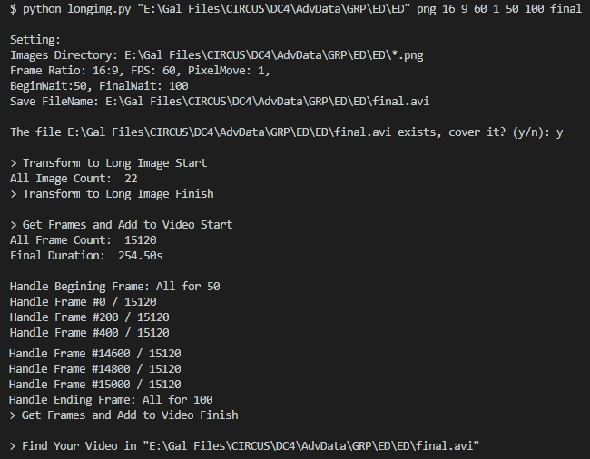
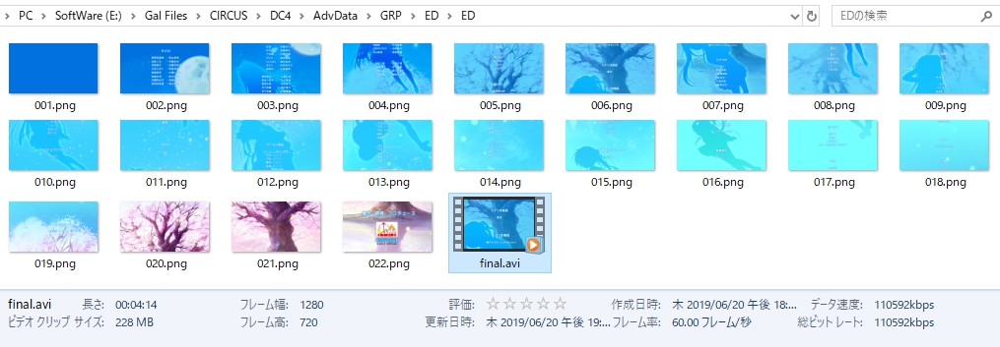

# Long Image To Video

### Environment
+ `Python` 3.6
+ `numpy` 
+ `PIL.Image`
+ `OpenCV ` 3.3.0

### Run
```python
# python longimg.py 
#	 <Extension> <Resolution> <Waiting frame> <Save filename>

python longimg.py "E:\Gal Files\CIRCUS\DC4\AdvData\GRP\ED\ED" png 16 9 60 100 final
```

### Screenshot



